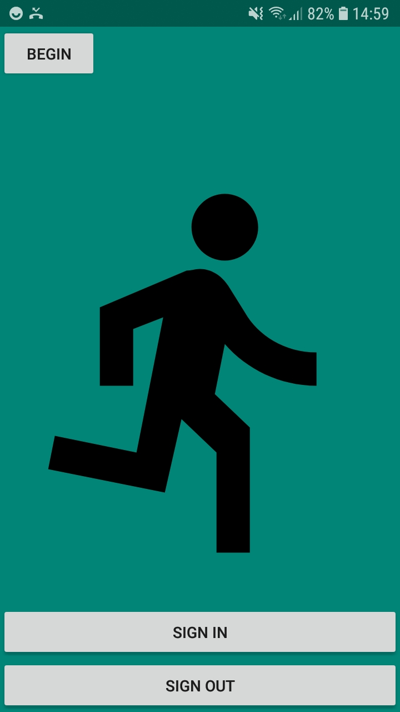
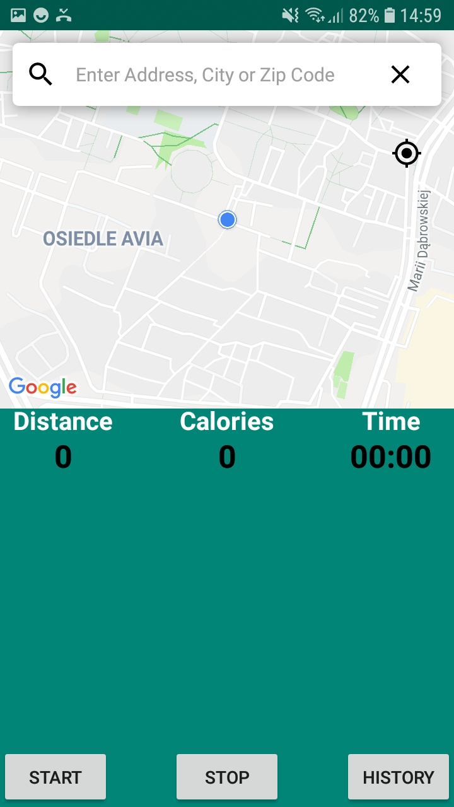
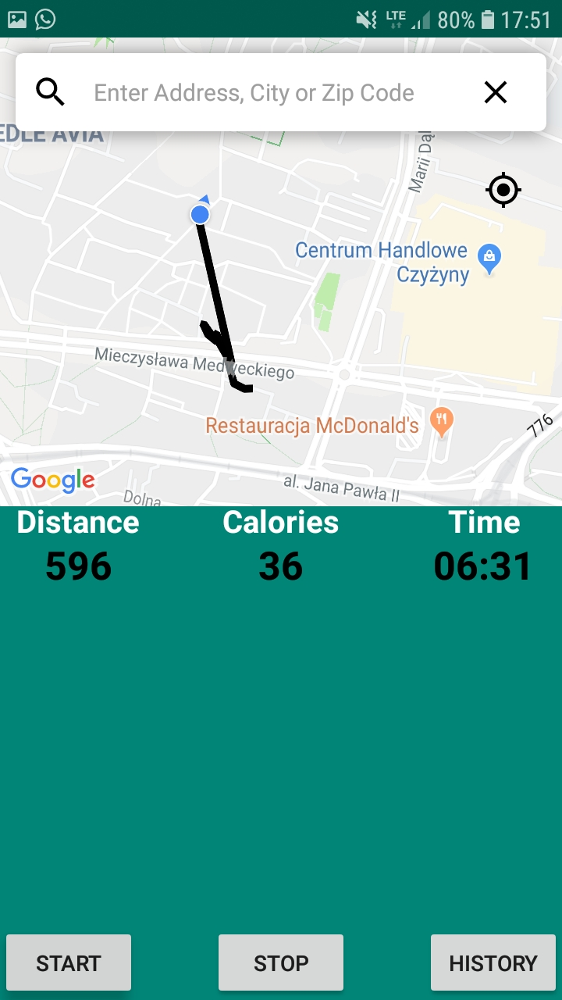
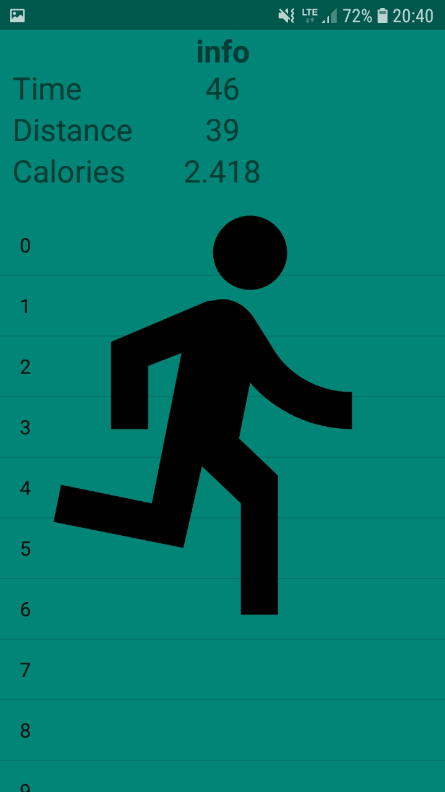

# Run-App
Android app designed to track run info. App measures a distance, time & calories in realtime. Implements database for users that collects data from each run in orded to give runners a better idea about their training improvements. App implements firebase authentication also all the data is stored in firebase realtime database.

# Use cases
[use case diagram](https://github.com/mpilchPL/Run-App/blob/master/img/usecase.pdf)

# Installing
To install app, download -.apk file and launch it on your android device. Minimum android version: 5.1.

# UI

# Authors
Michał Pilch,
Kamil Drążkiewicz,
Mateusz Szczudło,
Adam Rybicki
